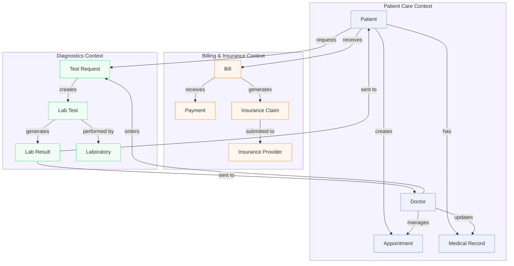

```mermaid
graph TB
    subgraph PatientCareContext["Patient Care Context"]
        Patient["Patient"]
        Doctor["Doctor"]
        Appointment["Appointment"]
        MedicalRecord["Medical Record"]
        Patient -->|creates| Appointment
        Doctor -->|manages| Appointment
        Patient -->|has| MedicalRecord
        Doctor -->|updates| MedicalRecord
    end

    subgraph BillingInsuranceContext["Billing & Insurance Context"]
        Bill["Bill"]
        Payment["Payment"]
        InsuranceClaim["Insurance Claim"]
        InsuranceProvider["Insurance Provider"]
        Bill -->|receives| Payment
        InsuranceClaim -->|submitted to| InsuranceProvider
        Bill -->|generates| InsuranceClaim
    end

    subgraph DiagnosticsContext["Diagnostics Context"]
        LabTest["Lab Test"]
        TestRequest["Test Request"]
        LabResult["Lab Result"]
        Laboratory["Laboratory"]
        TestRequest -->|creates| LabTest
        LabTest -->|performed by| Laboratory
        LabTest -->|generates| LabResult
    end

    Patient -->|requests| TestRequest
    Doctor -->|orders| TestRequest
    Patient -->|receives| Bill
    LabResult -->|sent to| Patient
    LabResult -->|sent to| Doctor

    classDef patientCareStyle stroke:#818cf8,fill:#eef2ff
    classDef billingStyle stroke:#fb923c,fill:#fff7ed
    classDef diagnosticsStyle stroke:#4ade80,fill:#f0fdf4
    classDef contextStyle stroke:#a78bfa,fill:#f5f3ff

    class Patient,Doctor,Appointment,MedicalRecord patientCareStyle
    class Bill,Payment,InsuranceClaim,InsuranceProvider billingStyle
    class LabTest,TestRequest,LabResult,Laboratory diagnosticsStyle
    class PatientCareContext,BillingInsuranceContext,DiagnosticsContext contextStyle
```
